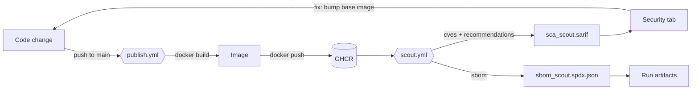

# Firstr-DevSecOps — CI/CD Pipeline & Container Security

[](https://github.com/TasosM12/Firstr-DevSecOps/actions/workflows/publish.yml)
[](https://github.com/TasosM12/Firstr-DevSecOps/actions/workflows/scout.yml)


An automated **build → delivery → security scanning** chain for a containerized application. GitHub Actions builds and publishes the Docker image on every change; **Docker Scout** scans the published image for known vulnerabilities (CVEs) and generates an SBOM; results land in the repository's **Security** tab as code scanning alerts.

- **CI/CD pipeline with GitHub Actions** for automated build and delivery to GitHub Container Registry (GHCR).
- **Integrated Docker Scout** to scan container images for known vulnerabilities (CVEs) and produce an SBOM, **shifting security left** in the pipeline.
- **Applied Docker hardening practices** (`.dockerignore`, minimal build context, targeted `COPY`) to **reduce the image attack surface**.

---

## Pipeline



```
Firstr-DevSecOps/
├── Dockerfile                     # JDK 17 base → javac → CMD
├── .dockerignore                  # Hardening: what never enters the build context
├── .github/workflows/
│   ├── publish.yml                # CI/CD: build & push to GHCR (automatic)
│   └── scout.yml                  # Security: CVEs + SBOM → SARIF → Security tab
└── src/com/uni/AlgoQuest/         # Application source (Java 17, zero dependencies)
```

---

## 1. CI/CD — build & delivery (`publish.yml`)

Triggered on every push to `main`. No manual compilation, no manual `docker push`.

| Element | Value | Why it matters |
|---|---|---|
| Trigger | `on: push: branches: [main]` | Every change produces a new artifact — continuous delivery. |
| Permissions | `contents: read`, `packages: write` | **Least privilege**: the workflow can write packages but not code. A leaked or hijacked token has a bounded blast radius. |
| Image name | `IMAGE=ghcr.io/${GITHUB_REPOSITORY,,}` | Bash `${VAR,,}` lowercases it. GitHub allows uppercase (`TasosM12/...`), Docker does not — without this the push fails. Derived from the repo, never hardcoded. |
| Auth | `docker/login-action@v3` + `secrets.GITHUB_TOKEN` | Token is issued per run and expires with it: **no long-lived registry credentials stored anywhere**. |
| Build & push | `docker/build-push-action@v6` | Buildx with layer caching and OCI metadata. |

Output: `ghcr.io/tasosm12/firstr-devsecops:latest`.

---

## 2. Security — scanning with Docker Scout (`scout.yml`)

### Shift left

```
Traditional:  code → build → deploy → …production… → security review   ❌ late, expensive
DevSecOps:    code → build → SCAN ✅ → delivery → production           ✅ early, automated
```

The finding reaches the developer **in GitHub, minutes after the change** — not in a quarterly report.

### What the workflow does

| Element | Value | Why it matters |
|---|---|---|
| Permissions | `packages: read`, `security-events: write` | `security-events: write` is what allows SARIF upload; without it the alerts never appear. |
| Target | `docker pull` of the published image | Scans **the delivered artifact**, not a local build — exactly what a user would run. |
| Scan | `command: cves,recommendations,sbom` | Vulnerabilities, base-image upgrade advice, and a full component inventory in one step. |
| Outputs | `sca_scout.sarif`, `sbom_scout.spdx.json` | Open standards (SARIF, SPDX) — readable by other tools, no vendor lock-in. |
| `exit-code: false` | Run stays green on findings | Deliberate: this stage is **observability, not a gate**. See §4 for turning it into a gate. |
| SARIF upload | `codeql-action/upload-sarif@v3`, `category: Security/SCA` | Each CVE becomes a code scanning alert with severity and history, so fixes are visibly closed. |

**SCA** analyses the image's *components* against vulnerability databases — it does not read source code (that is SAST). The **SBOM** (SPDX) is the full inventory of what ships: the answer to *"does the next Log4Shell affect us?"* in seconds. **SARIF** is the standard finding format the GitHub Security tab understands.

> SARIF upload to the Security tab is free on public repositories; private repos need GitHub Advanced Security. Either way both files remain as run artifacts.

---

## 3. Docker hardening

> Anything that enters a layer stays there **permanently** — deleting it in a later layer does not remove it from image history.

### `.dockerignore`

| Excluded | Reason |
|---|---|
| `.git` | **Critical.** Full history. A credential committed once and "removed" later still lives in `.git`. A public image containing it leaks everything. |
| `*.ser` | Serialized user data — production data has no place in a distribution artifact. |
| `algoquest_results*.txt` | User-generated output. |
| `out/`, `*.class` | Pre-compiled bytecode from a developer machine would contaminate a clean build. The image must be built **from source only**. |
| `.idea/`, `*.iml` | IDE settings leak local paths, usernames and machine layout for zero benefit. |
| `README.md` | Not needed at runtime. |

### Minimal build context

`docker build` packages the **entire folder** and ships it to the daemon. `.dockerignore` acts *before* that:

- **Security** — what never reaches the daemon cannot end up in a layer through a careless `COPY . .`.
- **Speed** — smaller context, faster builds, better cache use; in CI every push builds.
- **Determinism** — the build depends on an explicit file list, not on whatever happens to sit in the folder.

The `Dockerfile` also copies narrowly (`COPY src ./src`, never `COPY . .`) — defence in depth if something slips past `.dockerignore`.

Verify:

```bash
docker history ghcr.io/tasosm12/firstr-devsecops:latest
docker run --rm ghcr.io/tasosm12/firstr-devsecops:latest ls -la /app
```

### The Dockerfile

```dockerfile
FROM eclipse-temurin:17-jdk-jammy      # defines nearly the whole attack surface
WORKDIR /app
COPY src ./src                         # targeted copy, not COPY . .
RUN javac -encoding UTF-8 -d out src/com/uni/AlgoQuest/*.java
CMD ["java", "-cp", "out", "com.uni.AlgoQuest.Main"]
```

The application has **zero external dependencies** (plain JDK, no Maven/Gradle), so every SCA finding comes from the base image — OS packages and the JDK itself. The cheapest security fix in a container is usually **one `FROM` line**.

---


---

**The payload:** *AlgoQuest*, an educational algorithms game in Java 17 / Swing (University of Piraeus, Dept. of Informatics), with no external dependencies. It is the artifact that gets packaged, published and scanned — the pipeline around it is the subject of this repository. Entry point: `com.uni.AlgoQuest.Main`.

